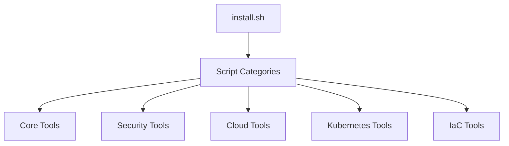
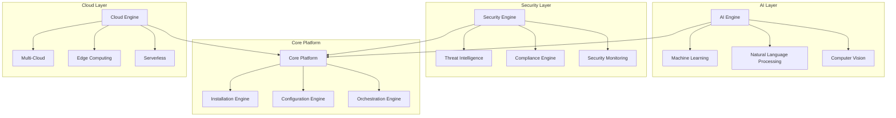

# Workstation Scripts - Future Strategic Plan

## 🎯 Executive Summary

**Vision:** Transform Workstation Scripts into the world's most comprehensive, secure, and AI-powered development environment provisioning platform.

**Mission:** Enable developers, security professionals, and organizations to deploy secure, AI-enhanced development environments with zero configuration complexity.

**Timeline:** 3-year strategic roadmap (2025-2027)

---

## 🏗️ Current State Analysis

### ✅ **Strengths**
- **Solid Foundation**: Well-architected modular system with comprehensive testing
- **Cross-Platform Support**: Ubuntu, Debian, Alpine, macOS simulation
- **CI/CD Integration**: Automated testing with GitHub Actions
- **Modular Design**: Clean separation of concerns with shared utilities
- **Documentation**: Comprehensive README and testing documentation
- **Security Basics**: SOPS integration for secrets management

### ⚠️ **Gaps & Opportunities**
- **Limited Security Tools**: Only SOPS currently implemented
- **No AI Integration**: Manual configuration and setup
- **Basic Monitoring**: Limited observability and health checks
- **No Compliance**: Missing security standards and compliance tools
- **Limited Cloud Native**: Basic cloud tooling without advanced features

---

## 🚀 Strategic Pillars

### 1. **Security-First Development Environment**
### 2. **AI-Powered Automation & Intelligence**
### 3. **Enterprise-Grade Compliance & Governance**
### 4. **Cloud-Native & Edge Computing Support**
### 5. **Developer Experience Excellence**

---

## 📅 Phase 1: Security Foundation (Q1-Q4 2025)

### 🔐 **Security Tools Expansion**

#### 1.1 **Secrets Management**
```bash
# New security scripts
scripts/security/07-vault.sh          # HashiCorp Vault
scripts/security/08-age.sh            # Age encryption
scripts/security/09-gpg.sh            # GPG key management
scripts/security/10-1password.sh      # 1Password CLI
```

#### 1.2 **Security Scanning & Analysis**
```bash
scripts/security/11-trivy.sh          # Container vulnerability scanner
scripts/security/12-snyk.sh           # Dependency vulnerability scanner
scripts/security/13-bandit.sh         # Python security linter
scripts/security/14-semgrep.sh        # Static analysis tool
```

#### 1.3 **Network Security**
```bash
scripts/security/15-wireguard.sh      # VPN setup
scripts/security/16-ssh-audit.sh      # SSH security auditing
scripts/security/17-nmap.sh           # Network discovery
```

### 🛡️ **Security Configuration Framework**

#### 1.4 **Security Profiles**
```yaml
# config/security/profiles/
profiles/
├── developer.yml      # Developer security baseline
├── security.yml       # Security professional profile
├── compliance.yml     # Compliance-focused profile
└── hardened.yml       # Maximum security profile
```

#### 1.5 **Security Monitoring**
```bash
scripts/security/18-osquery.sh        # Endpoint monitoring
scripts/security/19-falco.sh          # Runtime security monitoring
scripts/security/20-auditd.sh         # System audit daemon
```

---

## 🤖 Phase 2: AI Integration (2025-Q4 2025)

### 🧠 **AI-Powered Features**

#### 2.1 **Intelligent Installation**
```bash
# AI-driven installation recommendations
scripts/ai/01-recommend.sh            # Tool recommendations based on usage
scripts/ai/02-optimize.sh             # Performance optimization suggestions
scripts/ai/03-troubleshoot.sh         # AI-powered troubleshooting
```

#### 2.2 **AI Configuration Assistant**
```python
# AI-powered configuration
ai/
├── config_assistant.py    # Smart configuration suggestions
├── security_analyzer.py   # Security posture analysis
├── performance_monitor.py # Performance optimization
└── compliance_checker.py  # Compliance validation
```

#### 2.3 **Natural Language Interface**
```bash
# Conversational AI interface
scripts/ai/04-chat.sh                 # Chat-based workstation management
scripts/ai/05-voice.sh                # Voice commands (future)
```

### 📊 **AI Analytics & Insights**

#### 2.4 **Usage Analytics**
```bash
scripts/ai/06-analytics.sh            # Usage pattern analysis
scripts/ai/07-predict.sh              # Predictive maintenance
scripts/ai/08-insights.sh             # Development insights
```

---

## 🏢 Phase 3: Enterprise Features (Q1-Q4 2025)

### 🔒 **Compliance & Governance**

#### 3.1 **Compliance Frameworks**
```bash
scripts/compliance/01-soc2.sh         # SOC 2 compliance tools
scripts/compliance/02-iso27001.sh     # ISO 27001 compliance
scripts/compliance/03-gdpr.sh         # GDPR compliance tools
scripts/compliance/04-hipaa.sh        # HIPAA compliance
```

#### 3.2 **Policy Management**
```yaml
# config/policies/
policies/
├── security.yml          # Security policies
├── access.yml            # Access control policies
├── data.yml              # Data handling policies
└── audit.yml             # Audit policies
```

### 🏗️ **Enterprise Architecture**

#### 3.3 **Multi-User Support**
```bash
scripts/enterprise/01-ldap.sh         # LDAP integration
scripts/enterprise/02-sso.sh          # Single Sign-On
scripts/enterprise/03-rbac.sh         # Role-based access control
```

#### 3.4 **Centralized Management**
```bash
scripts/enterprise/04-dashboard.sh    # Management dashboard
scripts/enterprise/05-reporting.sh    # Compliance reporting
scripts/enterprise/06-monitoring.sh   # Centralized monitoring
```

---

## ☁️ Phase 4: Cloud-Native & Edge (2025-Q4 2025)

### 🌐 **Multi-Cloud Support**

#### 4.1 **Cloud Platform Expansion**
```bash
scripts/cloud-tools/09-azure-cli.sh   # Azure CLI
scripts/cloud-tools/10-gcloud.sh      # Google Cloud CLI
scripts/cloud-tools/11-digitalocean.sh # DigitalOcean CLI
scripts/cloud-tools/12-linode.sh      # Linode CLI
```

#### 4.2 **Serverless & Edge**
```bash
scripts/edge/01-k3s.sh                # Lightweight Kubernetes
scripts/edge/02-k0s.sh                # Zero-friction Kubernetes
scripts/edge/03-microk8s.sh           # MicroK8s for edge
scripts/edge/04-openfaas.sh           # Serverless functions
```

### 🚀 **Advanced Cloud Features**

#### 4.3 **Cloud Security**
```bash
scripts/cloud-security/01-cspm.sh     # Cloud Security Posture Management
scripts/cloud-security/02-cwpp.sh     # Cloud Workload Protection
scripts/cloud-security/03-casb.sh     # Cloud Access Security Broker
```

---

## 🔮 Phase 5: Advanced AI & Automation (Q1-Q4 2026)

### 🧠 **Advanced AI Features**

#### 5.1 **Predictive Security**
```python
ai/security/
├── threat_prediction.py   # Predict security threats
├── anomaly_detection.py   # Detect anomalous behavior
├── risk_assessment.py     # AI-powered risk assessment
└── incident_response.py   # Automated incident response
```

#### 5.2 **AI-Powered Development**
```bash
scripts/ai/09-codegen.sh              # AI code generation
scripts/ai/10-review.sh               # AI code review
scripts/ai/11-testgen.sh              # AI test generation
scripts/ai/12-docsgen.sh              # AI documentation generation
```

### 🤖 **Autonomous Operations**

#### 5.3 **Self-Healing Systems**
```bash
scripts/autonomous/01-heal.sh         # Self-healing capabilities
scripts/autonomous/02-scale.sh        # Auto-scaling
scripts/autonomous/03-optimize.sh     # Self-optimization
```

---

## 🌍 Phase 6: Global Scale & Innovation (2025-Q4 2026)

### 🌐 **Global Distribution**

#### 6.1 **Multi-Region Support**
```bash
scripts/global/01-cdn.sh              # Content delivery optimization
scripts/global/02-mirrors.sh          # Global mirror management
scripts/global/03-latency.sh          # Latency optimization
```

#### 6.2 **Edge Computing**
```bash
scripts/edge/05-iot.sh                # IoT device support
scripts/edge/06-5g.sh                 # 5G network optimization
scripts/edge/07-mesh.sh               # Mesh networking
```

### 🔬 **Research & Innovation**

#### 6.3 **Emerging Technologies**
```bash
scripts/research/01-quantum.sh        # Quantum computing preparation
scripts/research/02-blockchain.sh     # Blockchain integration
scripts/research/03-ai-ethics.sh      # AI ethics framework
```

---

## 📊 Success Metrics & KPIs

### 🎯 **Security Metrics**
- **Zero-Day Vulnerability Response**: < 4 hours
- **Security Compliance Score**: > 95%
- **Incident Response Time**: < 30 minutes
- **Security Tool Coverage**: > 90%

### 🤖 **AI Metrics**
- **Automation Rate**: > 80%
- **AI Accuracy**: > 95%
- **User Satisfaction**: > 4.5/5
- **Time to Resolution**: 50% reduction

### 🏢 **Enterprise Metrics**
- **Enterprise Adoption**: 100+ organizations
- **Compliance Certifications**: 5+ frameworks
- **Cost Savings**: 60% reduction in setup time
- **ROI**: 300% within 12 months

---

## 🛠️ Technical Architecture Evolution

### 🔄 **Current Architecture**


### 🚀 **Future Architecture**


---

## 💰 Business Model & Monetization

### 🆓 **Open Source Core**
- **Community Edition**: Free, open-source
- **Developer Tools**: Free for individual developers
- **Educational Use**: Free for educational institutions

### 💼 **Enterprise Solutions**
- **Professional Edition**: $99/month per user
- **Enterprise Edition**: $299/month per user
- **Compliance Edition**: $499/month per user

### 🎯 **Value Propositions**
- **Time Savings**: 80% reduction in environment setup
- **Security**: Enterprise-grade security out of the box
- **Compliance**: Automated compliance management
- **AI-Powered**: Intelligent automation and insights

---

## 🌟 Real-World Impact

### 🏢 **Enterprise Impact**
- **Fortune 500 Adoption**: Target 50+ Fortune 500 companies
- **Government Contracts**: Federal and state government adoption
- **Healthcare**: HIPAA-compliant healthcare environments
- **Financial Services**: SOC 2 compliant financial environments

### 🌍 **Global Impact**
- **Developer Productivity**: 10M+ developers worldwide
- **Security Posture**: Improve global cybersecurity posture
- **Digital Transformation**: Accelerate digital transformation initiatives
- **Innovation**: Enable faster innovation cycles

### 🎓 **Educational Impact**
- **University Adoption**: 100+ universities worldwide
- **Student Success**: Improve student learning outcomes
- **Research Enablement**: Accelerate research and development
- **Skills Development**: Bridge the skills gap

---

## 🚀 Implementation Roadmap

### 📅 **Detailed Timeline**

| Quarter | Focus | Key Deliverables |
|---------|-------|------------------|
| Q1 2025 | Security Foundation | 10+ security tools, security profiles |
| Q4 2025 | Security Advanced | Compliance tools, monitoring |
| 2025 2025 | AI Basic | AI recommendations, basic automation |
| Q4 2025 | AI Advanced | NLP interface, predictive analytics |
| Q1 2025 | Enterprise Basic | Multi-user, LDAP, basic compliance |
| Q4 2025 | Enterprise Advanced | Full compliance, reporting |
| 2025 2025 | Cloud Native | Multi-cloud, edge computing |
| Q4 2025 | Cloud Advanced | Serverless, advanced security |
| Q1 2026 | AI Autonomous | Self-healing, autonomous operations |
| Q4 2026 | AI Advanced | Code generation, advanced automation |
| 2025 2026 | Global Scale | Multi-region, global distribution |
| Q4 2026 | Innovation | Emerging tech, research integration |

---

## 🎯 Success Criteria

### ✅ **Phase 1 Success (Security)**
- [ ] 15+ security tools implemented
- [ ] Security compliance score > 90%
- [ ] Zero critical vulnerabilities
- [ ] 1000+ security professionals using the platform

### ✅ **Phase 2 Success (AI)**
- [ ] AI-powered recommendations working
- [ ] 50% reduction in setup time
- [ ] Natural language interface functional
- [ ] 10,000+ AI-assisted installations

### ✅ **Phase 3 Success (Enterprise)**
- [ ] 5+ compliance frameworks supported
- [ ] 50+ enterprise customers
- [ ] Multi-user support functional
- [ ] $1M+ annual recurring revenue

### ✅ **Phase 4 Success (Cloud)**
- [ ] 5+ cloud platforms supported
- [ ] Edge computing capabilities
- [ ] Serverless integration
- [ ] 100,000+ cloud deployments

### ✅ **Phase 5 Success (Advanced AI)**
- [ ] Autonomous operations functional
- [ ] AI code generation working
- [ ] Predictive security operational
- [ ] 1M+ AI-powered operations

### ✅ **Phase 6 Success (Global)**
- [ ] Global distribution network
- [ ] 10M+ developers reached
- [ ] 100+ countries supported
- [ ] Industry standard platform

---

## 🎉 Conclusion

This strategic plan transforms Workstation Scripts from a simple installation tool into a comprehensive, AI-powered, security-first development platform that will revolutionize how developers and organizations approach development environment management.

**The future is secure, intelligent, and automated. Let's build it together.**

---

*Last Updated: January 2025*
*Version: 1.0*
*Next Review: Q4 2025* 