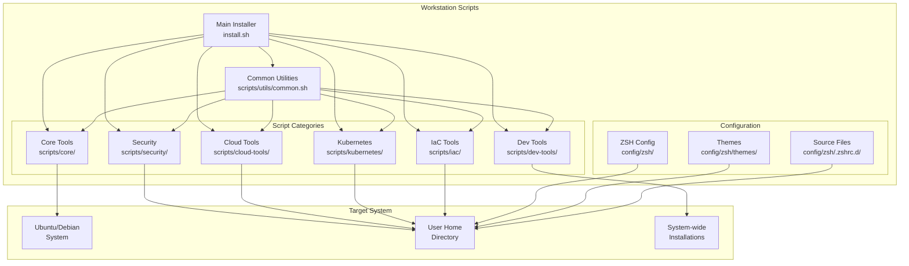
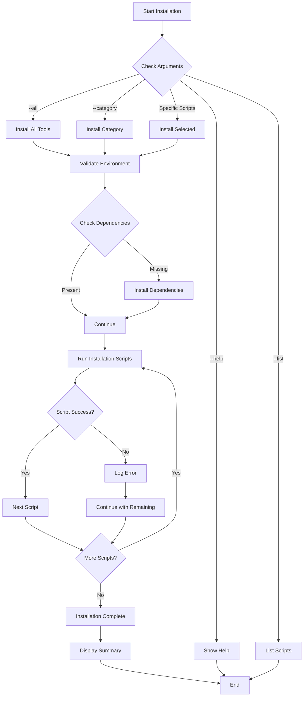
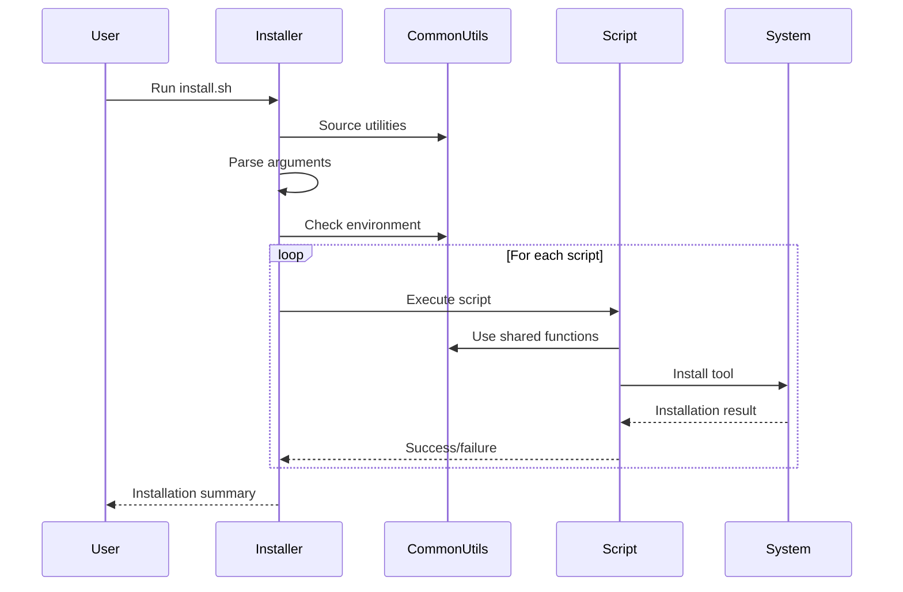

# Workstation Scripts

A comprehensive collection of automated installation scripts for setting up a modern development workstation on Ubuntu/Debian systems. This project provides a modular, maintainable approach to workstation provisioning with support for various development tools, cloud platforms, and infrastructure management.

## 🏗️ Architecture



## 📁 Project Structure

```
workstation-scripts/
├── install.sh                          # Main installer script
├── README.md                           # This file
├── scripts/                            # All installation scripts
│   ├── utils/
│   │   └── common.sh                   # Shared utilities and functions
│   ├── core/                           # Core system tools
│   │   └── 01-zsh.sh                   # ZSH and Oh My ZSH installation
│   ├── dev-tools/                      # Development tools
│   │   └── 04-docker.sh                # Docker CE installation
│   ├── security/                       # Security tools
│   │   └── 06-sops.sh                  # SOPS installation
│   ├── cloud-tools/                    # Cloud platform tools
│   │   └── 08-aws-cli.sh               # AWS CLI installation
│   ├── kubernetes/                     # Kubernetes ecosystem tools
│   │   ├── 15-kubectl.sh               # kubectl installation
│   │   ├── 17-flux.sh                  # Flux GitOps installation
│   │   ├── 21-k9s.sh                   # k9s cluster manager
│   │   └── 22-helm.sh                  # Helm package manager
│   └── iac/                            # Infrastructure as Code tools
│       └── 24-opentofu.sh              # OpenTofu installation
└── config/                             # Configuration files
    └── zsh/
        ├── themes/
        │   └── tez.zsh-theme           # Custom ZSH theme
        └── .zshrc.d/
            ├── base.source             # Base ZSH configuration
            ├── aws-cli.source          # AWS CLI configuration
            └── kubectl.source          # kubectl configuration
```

## 🔄 Installation Workflow



## 🛠️ Available Tools

### Core Tools
- **ZSH + Oh My ZSH**: Enhanced shell with custom theme and configuration
- **Custom Theme**: Tez theme with Kubernetes context and Git integration

### Development Tools
- **Docker CE**: Container platform for application development and deployment

### Security Tools
- **SOPS**: Secrets OPerationS for encrypted file management

### Cloud Tools
- **AWS CLI**: Command-line interface for Amazon Web Services

### Kubernetes Tools
- **kubectl**: Kubernetes command-line tool
- **Flux**: GitOps toolkit for Kubernetes
- **k9s**: Terminal-based UI for Kubernetes cluster management
- **Helm**: Kubernetes package manager

### Infrastructure as Code
- **OpenTofu**: Infrastructure as Code tool (Terraform alternative)

## 🚀 Quick Start

### Prerequisites
- Ubuntu/Debian-based system
- Internet connection
- Sudo privileges
- Bash shell

### Installation Options

#### Install All Tools
```bash
./install.sh --all
```

#### Install by Category
```bash
# Install only Kubernetes tools
./install.sh --category kubernetes

# Install only development tools
./install.sh --category dev-tools
```

#### Install Specific Tools
```bash
# Install specific tools
./install.sh 01-zsh 04-docker 15-kubectl
```

#### List Available Tools
```bash
./install.sh --list
```

#### Get Help
```bash
./install.sh --help
```

## 📋 Installation Process



## 🔧 Script Features

### Common Utilities (`scripts/utils/common.sh`)
- **Logging**: Colored output with different log levels
- **System Detection**: OS and architecture detection
- **Error Handling**: Comprehensive error handling and cleanup
- **Validation**: Dependency checking and environment validation
- **Download Functions**: Secure file downloading with progress
- **Installation Helpers**: Binary installation and symlink management

### Individual Script Features
- **Idempotent**: Safe to run multiple times
- **Error Recovery**: Graceful handling of failures
- **Progress Feedback**: Clear status updates during installation
- **Dependency Management**: Automatic dependency installation
- **Configuration Setup**: Automatic tool configuration
- **Shell Integration**: ZSH completion and aliases

## 🎨 Customization

### Adding New Tools
1. Create a new script in the appropriate category directory
2. Source the common utilities: `source "${SCRIPT_DIR}/../utils/common.sh"`
3. Follow the established pattern with clear function names
4. Add the script to the main installer's script mapping

### Modifying Configurations
- **ZSH Theme**: Edit `config/zsh/themes/tez.zsh-theme`
- **Tool Configurations**: Modify files in `config/zsh/.zshrc.d/`
- **Installation Logic**: Update individual scripts as needed

## 🔍 Troubleshooting

### Common Issues

#### Permission Denied
```bash
# Ensure scripts are executable
chmod +x install.sh scripts/**/*.sh
```

#### Network Issues
```bash
# Check internet connectivity
curl -I https://github.com
```

#### Dependency Issues
```bash
# Update package lists
sudo apt update
```

#### Tool Already Installed
- Scripts will detect existing installations and prompt for confirmation
- Use `--verbose` flag for detailed output

### Debug Mode
```bash
# Enable verbose output
./install.sh --verbose --category kubernetes
```

## 📊 Tool Compatibility

| Tool | Linux | macOS | Windows | Notes |
|------|-------|-------|---------|-------|
| ZSH | ✅ | ✅ | ❌ | Core functionality |
| Docker | ✅ | ❌ | ❌ | Use Docker Desktop for macOS |
| SOPS | ✅ | ✅ | ❌ | Cross-platform binary |
| AWS CLI | ✅ | ❌ | ❌ | Use Homebrew for macOS |
| kubectl | ✅ | ✅ | ❌ | Cross-platform binary |
| Flux | ✅ | ✅ | ❌ | Cross-platform binary |
| k9s | ✅ | ✅ | ❌ | Cross-platform binary |
| Helm | ✅ | ✅ | ❌ | Cross-platform binary |
| OpenTofu | ✅ | ✅ | ❌ | Cross-platform binary |

## 🤝 Contributing

### Development Workflow


### Guidelines
1. Follow existing code structure and patterns
2. Add comprehensive error handling
3. Include proper documentation
4. Test on clean Ubuntu/Debian systems
5. Update this README if adding new tools

## 📄 License

This project is licensed under the MIT License - see the LICENSE file for details.

## 🙏 Acknowledgments

- [Oh My ZSH](https://ohmyz.sh/) for the excellent shell framework
- [Flux](https://fluxcd.io/) for GitOps capabilities
- [k9s](https://k9scli.io/) for the amazing Kubernetes UI
- All the open-source tools that make development easier

---

**Note**: This project is designed for Ubuntu/Debian systems. For other operating systems, please refer to the individual tool documentation for installation instructions.

## 🧪 Testing in Different Environments

You can test the workstation scripts in real, clean environments using Docker and GitHub Actions. This ensures your scripts work on all major Linux distributions and macOS.

### Quick Test All Environments
Run all environment tests with a single command:
```bash
./test-all-environments.sh
```

### Individual Environment Tests

#### Test on Ubuntu (default)
```bash
# Build and run in Ubuntu
docker build -t workstation-test-ubuntu .
docker run --rm -it workstation-test-ubuntu
```

#### Test on Debian
```bash
# Build and run in Debian
docker build -f Dockerfile.debian -t workstation-test-debian .
docker run --rm -it workstation-test-debian
```

#### Test on Alpine
```bash
# Build and run in Alpine
docker build -f Dockerfile.alpine -t workstation-test-alpine .
docker run --rm -it workstation-test-alpine
```

#### Test on macOS Simulation
```bash
# Build and run in macOS-like environment (Linux with Homebrew)
docker build -f Dockerfile.macos-sim -t workstation-test-macos-sim .
docker run --rm -it workstation-test-macos-sim
```

**Note:** This simulates macOS behavior using Linux with Homebrew, but runs on Linux kernel.

### Using Docker Compose
Test all environments at once:
```bash
# Test all environments
docker-compose -f docker-compose.test.yml up --build

# Test specific environment
docker-compose -f docker-compose.test.yml run --rm test-ubuntu
docker-compose -f docker-compose.test.yml run --rm test-debian
docker-compose -f docker-compose.test.yml run --rm test-alpine
docker-compose -f docker-compose.test.yml run --rm test-macos-sim
```

### Test on Real macOS (locally)
- You cannot use Docker for real macOS. Use a real Mac or a macOS VM.
- Make sure you have a modern Bash (`brew install bash`).
- Run:
```bash
bash install.sh --list
```

### Automated CI Testing (Linux + macOS)
This project includes a GitHub Actions workflow in `.github/workflows/test.yml` that will automatically test your scripts on both Ubuntu and macOS on every push or pull request.

**No manual setup needed—just push to GitHub!**

---

**Summary Table:**

| Environment | How to Test | Docker Command |
|-------------|-------------|----------------|
| Ubuntu      | `docker build -t workstation-test-ubuntu . && docker run --rm -it workstation-test-ubuntu` | `docker-compose -f docker-compose.test.yml run --rm test-ubuntu` |
| Debian      | `docker build -f Dockerfile.debian -t workstation-test-debian . && docker run --rm -it workstation-test-debian` | `docker-compose -f docker-compose.test.yml run --rm test-debian` |
| Alpine      | `docker build -f Dockerfile.alpine -t workstation-test-alpine . && docker run --rm -it workstation-test-alpine` | `docker-compose -f docker-compose.test.yml run --rm test-alpine` |
| macOS Sim   | `docker build -f Dockerfile.macos-sim -t workstation-test-macos-sim . && docker run --rm -it workstation-test-macos-sim` | `docker-compose -f docker-compose.test.yml run --rm test-macos-sim` |
| macOS Real  | Use a real Mac, run `bash install.sh --list` | N/A |
| All (Auto)  | `./test-all-environments.sh` | `docker-compose -f docker-compose.test.yml up --build` |
| CI (all)    | GitHub Actions workflow runs on every push | N/A |

---
