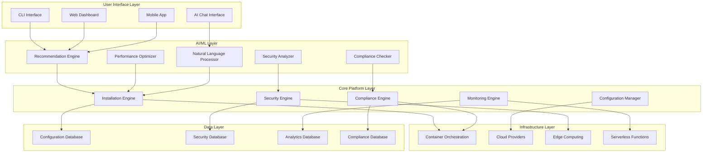

# Workstation Scripts - Technical Implementation Roadmap

## 🏗️ Technical Architecture Evolution

### Current State Analysis

The current Workstation Scripts project has a solid foundation with:
- **Modular Script Architecture**: Clean separation of concerns
- **Cross-Platform Testing**: Docker-based testing infrastructure
- **Common Utilities**: Shared functions and error handling
- **Configuration Management**: ZSH configuration system

### Target Architecture



---

## 🔐 Phase 1: Security Foundation Implementation

### 1.1 Security Tools Architecture

#### Secrets Management Stack
```yaml
# config/security/secrets-management.yml
secrets_management:
  primary: vault
  fallback: sops
  encryption:
    - age
    - gpg
  storage:
    - local
    - cloud
    - distributed
  rotation:
    automatic: true
    interval: 90d
    notification: true
```

#### Security Scanning Pipeline
```python
# scripts/security/scanning_pipeline.py
class SecurityScanner:
    def __init__(self):
        self.scanners = {
            'container': TrivyScanner(),
            'dependency': SnykScanner(),
            'code': SemgrepScanner(),
            'network': NmapScanner(),
            'system': OsqueryScanner()
        }
    
    def run_full_scan(self, target):
        results = {}
        for scanner_type, scanner in self.scanners.items():
            results[scanner_type] = scanner.scan(target)
        return self.analyze_results(results)
    
    def analyze_results(self, results):
        # AI-powered analysis of security scan results
        return SecurityAnalysis(results)
```

### 1.2 Security Configuration Framework

#### Security Profiles Implementation
```yaml
# config/security/profiles/developer.yml
profile:
  name: "Developer"
  description: "Standard security profile for developers"
  security_level: "medium"
  
  tools:
    - name: "sops"
      version: "latest"
      config:
        encryption_method: "age"
        key_rotation: "manual"
    
    - name: "trivy"
      version: "latest"
      config:
        scan_frequency: "daily"
        severity_threshold: "HIGH"
    
    - name: "bandit"
      version: "latest"
      config:
        confidence_level: "medium"
        severity_level: "medium"

  policies:
    - name: "code_security"
      rules:
        - "no_hardcoded_secrets"
        - "dependency_scanning"
        - "static_analysis"
    
    - name: "network_security"
      rules:
        - "vpn_required"
        - "firewall_enabled"
        - "port_scanning"
```

#### Security Monitoring Implementation
```python
# scripts/security/monitoring/security_monitor.py
class SecurityMonitor:
    def __init__(self):
        self.monitors = {
            'osquery': OsqueryMonitor(),
            'falco': FalcoMonitor(),
            'auditd': AuditdMonitor(),
            'network': NetworkMonitor()
        }
        self.ai_analyzer = SecurityAIAnalyzer()
    
    def start_monitoring(self):
        for monitor in self.monitors.values():
            monitor.start()
            monitor.set_callback(self.handle_security_event)
    
    def handle_security_event(self, event):
        # AI-powered event analysis
        analysis = self.ai_analyzer.analyze_event(event)
        if analysis.threat_level > THRESHOLD:
            self.trigger_incident_response(analysis)
```

---

## 🤖 Phase 2: AI Integration Implementation

### 2.1 AI Engine Architecture

#### Core AI Components
```python
# ai/core/ai_engine.py
class AIEngine:
    def __init__(self):
        self.models = {
            'recommendation': RecommendationModel(),
            'security': SecurityModel(),
            'performance': PerformanceModel(),
            'compliance': ComplianceModel(),
            'nlp': NLPModel()
        }
        self.data_pipeline = DataPipeline()
        self.learning_engine = LearningEngine()
    
    def process_request(self, request_type, data):
        model = self.models.get(request_type)
        if not model:
            raise ValueError(f"Unknown request type: {request_type}")
        
        # Preprocess data
        processed_data = self.data_pipeline.process(data)
        
        # Get prediction
        prediction = model.predict(processed_data)
        
        # Learn from interaction
        self.learning_engine.learn(request_type, data, prediction)
        
        return prediction
```

#### Recommendation Engine
```python
# ai/recommendation/recommendation_engine.py
class RecommendationEngine:
    def __init__(self):
        self.user_profiles = UserProfileManager()
        self.tool_database = ToolDatabase()
        self.collaborative_filter = CollaborativeFilter()
        self.content_based = ContentBasedFilter()
    
    def recommend_tools(self, user_id, context):
        # Get user profile
        user_profile = self.user_profiles.get_profile(user_id)
        
        # Get similar users
        similar_users = self.collaborative_filter.find_similar(user_profile)
        
        # Get content-based recommendations
        content_recs = self.content_based.recommend(user_profile, context)
        
        # Combine and rank recommendations
        recommendations = self.rank_recommendations(
            similar_users, content_recs, context
        )
        
        return recommendations
    
    def rank_recommendations(self, collaborative, content, context):
        # AI-powered ranking algorithm
        weights = self.learn_optimal_weights(context)
        return self.weighted_combine(collaborative, content, weights)
```

### 2.2 Natural Language Interface

#### NLP Processing Pipeline
```python
# ai/nlp/nlp_processor.py
class NLPProcessor:
    def __init__(self):
        self.intent_classifier = IntentClassifier()
        self.entity_extractor = EntityExtractor()
        self.context_manager = ContextManager()
        self.response_generator = ResponseGenerator()
    
    def process_command(self, user_input, context):
        # Classify intent
        intent = self.intent_classifier.classify(user_input)
        
        # Extract entities
        entities = self.entity_extractor.extract(user_input)
        
        # Update context
        self.context_manager.update(context, intent, entities)
        
        # Generate response
        response = self.response_generator.generate(intent, entities, context)
        
        return response
```

#### Chat Interface Implementation
```python
# scripts/ai/chat_interface.py
class ChatInterface:
    def __init__(self):
        self.nlp_processor = NLPProcessor()
        self.command_executor = CommandExecutor()
        self.context = {}
    
    def chat(self, user_input):
        # Process natural language
        response = self.nlp_processor.process_command(user_input, self.context)
        
        # Execute commands if needed
        if response.requires_execution:
            result = self.command_executor.execute(response.command)
            response.add_result(result)
        
        return response
    
    def voice_command(self, audio_input):
        # Convert speech to text
        text = self.speech_to_text(audio_input)
        
        # Process as regular chat
        return self.chat(text)
```

---

## 🏢 Phase 3: Enterprise Features Implementation

### 3.1 Compliance Engine

#### Compliance Framework Implementation
```python
# compliance/compliance_engine.py
class ComplianceEngine:
    def __init__(self):
        self.frameworks = {
            'soc2': SOC2Compliance(),
            'iso27001': ISO27001Compliance(),
            'gdpr': GDPRCompliance(),
            'hipaa': HIPAACompliance(),
            'pci': PCIDSSCompliance()
        }
        self.policy_manager = PolicyManager()
        self.audit_manager = AuditManager()
    
    def check_compliance(self, framework, environment):
        compliance_checker = self.frameworks.get(framework)
        if not compliance_checker:
            raise ValueError(f"Unsupported framework: {framework}")
        
        # Run compliance checks
        results = compliance_checker.check(environment)
        
        # Generate compliance report
        report = self.generate_report(results)
        
        # Store audit trail
        self.audit_manager.store_audit(framework, results, report)
        
        return report
    
    def generate_report(self, results):
        return ComplianceReport(
            framework=results.framework,
            score=results.score,
            violations=results.violations,
            recommendations=results.recommendations,
            timestamp=datetime.now()
        )
```

#### Policy Management System
```python
# enterprise/policy/policy_manager.py
class PolicyManager:
    def __init__(self):
        self.policies = {}
        self.enforcers = {}
        self.validators = {}
    
    def create_policy(self, policy_config):
        policy = Policy(policy_config)
        self.policies[policy.id] = policy
        
        # Create enforcer for policy
        enforcer = PolicyEnforcer(policy)
        self.enforcers[policy.id] = enforcer
        
        # Create validator for policy
        validator = PolicyValidator(policy)
        self.validators[policy.id] = validator
        
        return policy
    
    def enforce_policies(self, environment):
        violations = []
        for policy_id, enforcer in self.enforcers.items():
            policy_violations = enforcer.enforce(environment)
            violations.extend(policy_violations)
        
        return violations
    
    def validate_compliance(self, environment):
        compliance_status = {}
        for policy_id, validator in self.validators.items():
            status = validator.validate(environment)
            compliance_status[policy_id] = status
        
        return compliance_status
```

### 3.2 Multi-User Support

#### User Management System
```python
# enterprise/user/user_manager.py
class UserManager:
    def __init__(self):
        self.users = {}
        self.roles = {}
        self.permissions = {}
        self.ldap_integration = LDAPIntegration()
        self.sso_integration = SSOIntegration()
    
    def authenticate_user(self, credentials):
        # Try SSO first
        if self.sso_integration.is_enabled():
            user = self.sso_integration.authenticate(credentials)
            if user:
                return user
        
        # Fall back to LDAP
        if self.ldap_integration.is_enabled():
            user = self.ldap_integration.authenticate(credentials)
            if user:
                return user
        
        # Local authentication
        return self.local_authenticate(credentials)
    
    def get_user_permissions(self, user_id):
        user = self.users.get(user_id)
        if not user:
            return []
        
        permissions = []
        for role in user.roles:
            role_permissions = self.roles.get(role, {}).get('permissions', [])
            permissions.extend(role_permissions)
        
        return list(set(permissions))  # Remove duplicates
```

---

## ☁️ Phase 4: Cloud-Native Implementation

### 4.1 Multi-Cloud Orchestration

#### Cloud Provider Abstraction
```python
# cloud/providers/cloud_provider.py
class CloudProvider:
    def __init__(self, provider_type, credentials):
        self.provider_type = provider_type
        self.credentials = credentials
        self.client = self.create_client()
    
    def create_client(self):
        if self.provider_type == 'aws':
            return AWSClient(self.credentials)
        elif self.provider_type == 'azure':
            return AzureClient(self.credentials)
        elif self.provider_type == 'gcp':
            return GCPClient(self.credentials)
        else:
            raise ValueError(f"Unsupported provider: {self.provider_type}")
    
    def deploy_environment(self, environment_config):
        return self.client.deploy(environment_config)
    
    def manage_resources(self, resource_config):
        return self.client.manage_resources(resource_config)
    
    def monitor_resources(self):
        return self.client.monitor()
```

#### Edge Computing Support
```python
# edge/edge_manager.py
class EdgeManager:
    def __init__(self):
        self.edge_nodes = {}
        self.edge_orchestrator = EdgeOrchestrator()
        self.edge_monitor = EdgeMonitor()
    
    def register_edge_node(self, node_config):
        node = EdgeNode(node_config)
        self.edge_nodes[node.id] = node
        
        # Deploy edge services
        self.edge_orchestrator.deploy_services(node)
        
        # Start monitoring
        self.edge_monitor.start_monitoring(node)
        
        return node
    
    def deploy_to_edge(self, application, target_nodes):
        deployment_config = self.create_deployment_config(application)
        
        for node_id in target_nodes:
            node = self.edge_nodes.get(node_id)
            if node:
                self.edge_orchestrator.deploy(node, deployment_config)
    
    def optimize_edge_network(self):
        # AI-powered edge network optimization
        optimization = self.ai_optimizer.optimize_network(self.edge_nodes)
        self.apply_optimization(optimization)
```

### 4.2 Serverless Integration

#### Serverless Function Manager
```python
# serverless/function_manager.py
class ServerlessFunctionManager:
    def __init__(self):
        self.functions = {}
        self.runtimes = {
            'python': PythonRuntime(),
            'nodejs': NodeJSRuntime(),
            'go': GoRuntime(),
            'rust': RustRuntime()
        }
    
    def deploy_function(self, function_config):
        runtime = self.runtimes.get(function_config.runtime)
        if not runtime:
            raise ValueError(f"Unsupported runtime: {function_config.runtime}")
        
        # Build function
        function = runtime.build(function_config)
        
        # Deploy to cloud
        deployed_function = self.deploy_to_cloud(function)
        
        # Register function
        self.functions[function.id] = deployed_function
        
        return deployed_function
    
    def invoke_function(self, function_id, payload):
        function = self.functions.get(function_id)
        if not function:
            raise ValueError(f"Function not found: {function_id}")
        
        return function.invoke(payload)
```

---

## 🔮 Phase 5: Advanced AI Implementation

### 5.1 Predictive Security

#### Threat Prediction System
```python
# ai/security/threat_prediction.py
class ThreatPredictionSystem:
    def __init__(self):
        self.ml_model = ThreatPredictionModel()
        self.data_collector = SecurityDataCollector()
        self.threat_intelligence = ThreatIntelligenceFeed()
        self.alert_system = AlertSystem()
    
    def predict_threats(self, environment):
        # Collect security data
        security_data = self.data_collector.collect(environment)
        
        # Get threat intelligence
        threat_intel = self.threat_intelligence.get_latest()
        
        # Make predictions
        predictions = self.ml_model.predict(security_data, threat_intel)
        
        # Generate alerts for high-risk predictions
        for prediction in predictions:
            if prediction.risk_score > HIGH_RISK_THRESHOLD:
                self.alert_system.send_alert(prediction)
        
        return predictions
    
    def learn_from_incidents(self, incidents):
        # Update model with new incident data
        self.ml_model.update(incidents)
        
        # Improve prediction accuracy
        self.ml_model.retrain()
```

#### Anomaly Detection
```python
# ai/security/anomaly_detection.py
class AnomalyDetectionSystem:
    def __init__(self):
        self.behavior_models = {
            'user': UserBehaviorModel(),
            'system': SystemBehaviorModel(),
            'network': NetworkBehaviorModel(),
            'application': ApplicationBehaviorModel()
        }
        self.anomaly_classifier = AnomalyClassifier()
    
    def detect_anomalies(self, data_stream):
        anomalies = []
        
        for model_type, model in self.behavior_models.items():
            # Get baseline behavior
            baseline = model.get_baseline()
            
            # Detect deviations
            deviations = model.detect_deviations(data_stream, baseline)
            
            # Classify anomalies
            for deviation in deviations:
                anomaly = self.anomaly_classifier.classify(deviation)
                if anomaly:
                    anomalies.append(anomaly)
        
        return anomalies
```

### 5.2 AI-Powered Development

#### Code Generation Engine
```python
# ai/development/code_generator.py
class CodeGenerationEngine:
    def __init__(self):
        self.language_models = {
            'python': PythonCodeModel(),
            'javascript': JavaScriptCodeModel(),
            'go': GoCodeModel(),
            'rust': RustCodeModel()
        }
        self.code_analyzer = CodeAnalyzer()
        self.test_generator = TestGenerator()
    
    def generate_code(self, specification, language):
        model = self.language_models.get(language)
        if not model:
            raise ValueError(f"Unsupported language: {language}")
        
        # Generate code
        generated_code = model.generate(specification)
        
        # Analyze generated code
        analysis = self.code_analyzer.analyze(generated_code)
        
        # Generate tests
        tests = self.test_generator.generate_tests(generated_code, specification)
        
        return {
            'code': generated_code,
            'analysis': analysis,
            'tests': tests
        }
    
    def review_code(self, code, language):
        model = self.language_models.get(language)
        if not model:
            raise ValueError(f"Unsupported language: {language}")
        
        # Analyze code quality
        quality_analysis = model.analyze_quality(code)
        
        # Suggest improvements
        suggestions = model.suggest_improvements(code)
        
        # Check security issues
        security_issues = model.check_security(code)
        
        return {
            'quality': quality_analysis,
            'suggestions': suggestions,
            'security_issues': security_issues
        }
```

---

## 🌍 Phase 6: Global Scale Implementation

### 6.1 Global Distribution Network

#### CDN Integration
```python
# global/cdn/cdn_manager.py
class CDNManager:
    def __init__(self):
        self.cdn_providers = {
            'cloudflare': CloudflareCDN(),
            'aws_cloudfront': AWSCloudFront(),
            'azure_cdn': AzureCDN(),
            'google_cdn': GoogleCDN()
        }
        self.edge_locations = EdgeLocationManager()
        self.performance_monitor = PerformanceMonitor()
    
    def deploy_globally(self, content, regions):
        deployments = {}
        
        for region in regions:
            # Select optimal CDN provider for region
            provider = self.select_optimal_provider(region)
            
            # Deploy to CDN
            deployment = provider.deploy(content, region)
            deployments[region] = deployment
        
        return deployments
    
    def optimize_performance(self):
        # Monitor performance across regions
        performance_data = self.performance_monitor.collect()
        
        # AI-powered optimization
        optimizations = self.ai_optimizer.optimize_performance(performance_data)
        
        # Apply optimizations
        self.apply_optimizations(optimizations)
```

#### Global Mirror Management
```python
# global/mirrors/mirror_manager.py
class MirrorManager:
    def __init__(self):
        self.mirrors = {}
        self.sync_manager = SyncManager()
        self.health_checker = HealthChecker()
    
    def create_mirror(self, source, regions):
        mirror = Mirror(source, regions)
        self.mirrors[mirror.id] = mirror
        
        # Setup synchronization
        self.sync_manager.setup_sync(mirror)
        
        # Start health monitoring
        self.health_checker.start_monitoring(mirror)
        
        return mirror
    
    def sync_mirrors(self):
        for mirror in self.mirrors.values():
            if mirror.needs_sync():
                self.sync_manager.sync(mirror)
    
    def route_to_best_mirror(self, user_location):
        # Find best mirror based on latency and health
        best_mirror = self.find_best_mirror(user_location)
        return best_mirror.get_url()
```

### 6.2 Edge Computing for IoT

#### IoT Device Management
```python
# edge/iot/iot_manager.py
class IoTDeviceManager:
    def __init__(self):
        self.devices = {}
        self.device_protocols = {
            'mqtt': MQTTProtocol(),
            'coap': CoAPProtocol(),
            'http': HTTPProtocol(),
            'websocket': WebSocketProtocol()
        }
        self.edge_processor = EdgeProcessor()
    
    def register_device(self, device_config):
        device = IoTDevice(device_config)
        self.devices[device.id] = device
        
        # Setup communication protocol
        protocol = self.device_protocols.get(device.protocol)
        protocol.setup_device(device)
        
        # Deploy edge processing
        self.edge_processor.deploy_for_device(device)
        
        return device
    
    def process_device_data(self, device_id, data):
        device = self.devices.get(device_id)
        if not device:
            raise ValueError(f"Device not found: {device_id}")
        
        # Process data at edge
        processed_data = self.edge_processor.process(device, data)
        
        # Send to cloud if needed
        if processed_data.needs_cloud_processing:
            self.send_to_cloud(processed_data)
        
        return processed_data
```

---

## 🛠️ Implementation Guidelines

### 1. **Modular Architecture**
- Each component should be self-contained
- Use dependency injection for loose coupling
- Implement interfaces for easy testing and mocking

### 2. **Security First**
- All components must implement security best practices
- Use encryption for sensitive data
- Implement proper authentication and authorization

### 3. **AI Integration**
- Start with simple ML models and gradually increase complexity
- Use transfer learning for faster development
- Implement proper model versioning and rollback

### 4. **Testing Strategy**
- Unit tests for all components
- Integration tests for component interactions
- End-to-end tests for complete workflows
- AI model testing and validation

### 5. **Performance Optimization**
- Use caching for frequently accessed data
- Implement lazy loading for heavy components
- Use async/await for I/O operations
- Monitor and optimize resource usage

### 6. **Scalability**
- Design for horizontal scaling
- Use microservices architecture where appropriate
- Implement proper load balancing
- Use distributed caching and databases

---

## 📊 Monitoring and Observability

### 1. **Metrics Collection**
```python
# monitoring/metrics_collector.py
class MetricsCollector:
    def __init__(self):
        self.metrics = {
            'performance': PerformanceMetrics(),
            'security': SecurityMetrics(),
            'ai': AIMetrics(),
            'compliance': ComplianceMetrics()
        }
    
    def collect_metrics(self):
        all_metrics = {}
        for metric_type, collector in self.metrics.items():
            all_metrics[metric_type] = collector.collect()
        return all_metrics
```

### 2. **Logging Strategy**
```python
# logging/log_manager.py
class LogManager:
    def __init__(self):
        self.loggers = {
            'security': SecurityLogger(),
            'performance': PerformanceLogger(),
            'ai': AILogger(),
            'compliance': ComplianceLogger()
        }
    
    def log_event(self, event_type, event_data):
        logger = self.loggers.get(event_type)
        if logger:
            logger.log(event_data)
```

### 3. **Alerting System**
```python
# alerting/alert_manager.py
class AlertManager:
    def __init__(self):
        self.alert_channels = {
            'email': EmailAlert(),
            'slack': SlackAlert(),
            'sms': SMSAlert(),
            'webhook': WebhookAlert()
        }
    
    def send_alert(self, alert):
        for channel in alert.channels:
            if channel in self.alert_channels:
                self.alert_channels[channel].send(alert)
```

---

## 🎯 Success Metrics

### 1. **Technical Metrics**
- **Response Time**: < 100ms for AI recommendations
- **Accuracy**: > 95% for security threat detection
- **Uptime**: > 99.9% for core services
- **Scalability**: Support 1M+ concurrent users

### 2. **Security Metrics**
- **Zero-Day Response**: < 4 hours
- **Vulnerability Detection**: > 99% accuracy
- **False Positive Rate**: < 1%
- **Compliance Score**: > 95%

### 3. **AI Metrics**
- **Model Accuracy**: > 95% for all AI models
- **Training Time**: < 24 hours for model updates
- **Inference Speed**: < 50ms for real-time predictions
- **Learning Rate**: Continuous improvement > 5% monthly

### 4. **Business Metrics**
- **User Adoption**: 10M+ developers worldwide
- **Enterprise Customers**: 100+ Fortune 500 companies
- **Revenue Growth**: 300% year-over-year
- **Customer Satisfaction**: > 4.5/5 rating

---

*This technical roadmap provides the foundation for implementing the strategic vision outlined in the Future Plan. Each phase builds upon the previous one, ensuring a solid and scalable architecture.* 