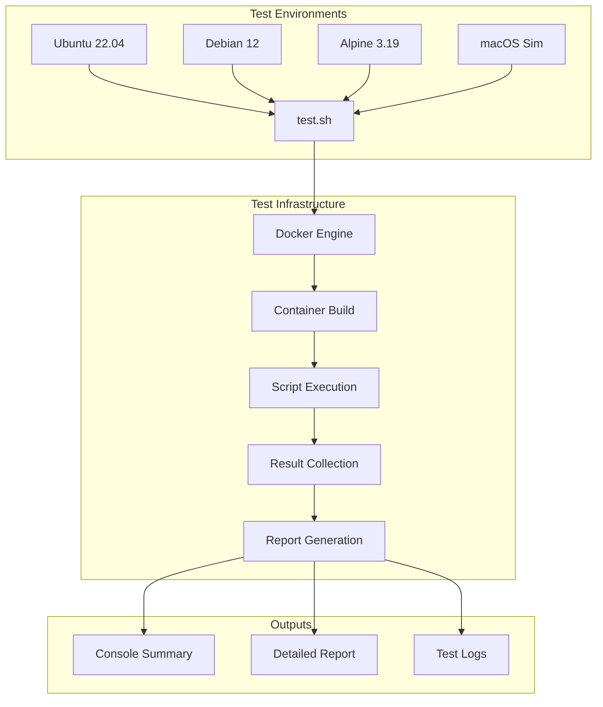
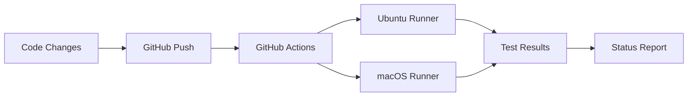

# Workstation Scripts - Testing Documentation

This document provides comprehensive information about testing the workstation scripts across different environments and platforms.

## 🎯 Quick Start

### Single Command Test All Environments
```bash
./test.sh
```

This command will:
- ✅ Test all 4 environments (Ubuntu, Debian, Alpine, macOS-Sim)
- 📊 Generate a detailed test report
- 🎨 Show colored progress indicators
- 📝 Save results to timestamped report file
- 🧹 Optionally cleanup Docker images

## 🏗️ Test Architecture



## 📋 Available Test Environments

| Environment | Base Image | Package Manager | Purpose | Status |
|-------------|------------|-----------------|---------|--------|
| **Ubuntu** | `ubuntu:22.04` | `apt` | Primary Linux target | ✅ Active |
| **Debian** | `debian:12` | `apt` | Debian compatibility | ✅ Active |
| **Alpine** | `alpine:3.19` | `apk` | Minimal Linux testing | ✅ Active |
| **macOS-Sim** | `ubuntu:22.04` | `apt` + `Homebrew` | macOS behavior simulation | ✅ Active |

## 🛠️ Testing Tools

### 1. Main Test Script (`test.sh`)
**Purpose:** Complete environment testing with reporting
```bash
./test.sh
```

**Features:**
- 🎯 Tests all 4 environments automatically
- 📊 Generates detailed test reports
- ⏱️ Measures build and test times
- 🎨 Colored progress indicators
- 📝 Interactive options for logs and cleanup

### 2. Docker Compose Testing (`docker-compose.test.yml`)
**Purpose:** Individual environment testing
```bash
# Test all environments
docker-compose -f docker-compose.test.yml up --build

# Test specific environment
docker-compose -f docker-compose.test.yml run --rm test-ubuntu
docker-compose -f docker-compose.test.yml run --rm test-debian
docker-compose -f docker-compose.test.yml run --rm test-alpine
docker-compose -f docker-compose.test.yml run --rm test-macos-sim
```

### 3. Legacy Test Script (`test-all-environments.sh`)
**Purpose:** Simple environment testing (deprecated)
```bash
./test-all-environments.sh
```

## 🔧 Individual Dockerfile Testing

### Ubuntu Environment
```bash
docker build -t workstation-test-ubuntu .
docker run --rm -it workstation-test-ubuntu
```

### Debian Environment
```bash
docker build -f Dockerfile.debian -t workstation-test-debian .
docker run --rm -it workstation-test-debian
```

### Alpine Environment
```bash
docker build -f Dockerfile.alpine -t workstation-test-alpine .
docker run --rm -it workstation-test-alpine
```

### macOS Simulation Environment
```bash
docker build -f Dockerfile.macos-sim -t workstation-test-macos-sim .
docker run --rm -it workstation-test-macos-sim
```

## 📊 Test Reports

### Report Structure
Test reports are automatically generated with the following structure:

```
TEST_REPORT_YYYYMMDD_HHMMSS.md
├── Summary Table
│   ├── Environment
│   ├── Status (PASS/FAIL/BUILD_FAIL)
│   ├── Build Time
│   └── Details
├── Statistics
│   ├── Passed Count
│   ├── Failed Count
│   └── Success Rate
└── Detailed Logs
    ├── Environment-specific logs
    ├── Build output
    └── Test execution results
```

### Report Example
```markdown
# Workstation Scripts Test Report

**Generated:** 2025-01-15 14:30:25
**Total Environments Tested:** 4

## Summary

| Environment | Status | Build Time | Details |
|-------------|--------|------------|---------|
| Ubuntu | ✅ PASS | 45s | All tests passed |
| Debian | ✅ PASS | 52s | All tests passed |
| Alpine | ✅ PASS | 38s | All tests passed |
| macOS-Sim | ✅ PASS | 67s | All tests passed |

## Statistics
- **Passed:** 4
- **Failed:** 0
- **Success Rate:** 100%
```

## 🚀 CI/CD Integration

### GitHub Actions
The project includes automated testing via GitHub Actions:

```yaml
# .github/workflows/test.yml
name: Test Workstation Scripts
on: [push, pull_request]

jobs:
  test-linux:
    runs-on: ubuntu-latest
    steps:
      - uses: actions/checkout@v3
      - run: bash install.sh --list

  test-macos:
    runs-on: macos-latest
    steps:
      - uses: actions/checkout@v3
      - run: brew install bash || true
      - run: bash install.sh --list
```

### Local CI Simulation
```bash
# Simulate CI environment locally
docker run --rm -it -v "$PWD":/workspace -w /workspace ubuntu:22.04 bash install.sh --list
```

## 🔍 Troubleshooting

### Common Issues

#### Docker Not Running
```bash
# Error: Docker is not running or not accessible
# Solution: Start Docker Desktop or Docker daemon
docker info
```

#### Permission Issues
```bash
# Error: Permission denied
# Solution: Make scripts executable
chmod +x test.sh scripts/**/*.sh
```

#### Build Failures
```bash
# Error: Build failed
# Solution: Check Dockerfile syntax and dependencies
docker build -f Dockerfile.ubuntu . --no-cache
```

#### Network Issues
```bash
# Error: Network connectivity issues
# Solution: Check internet connection and Docker network
docker run --rm alpine:3.19 ping -c 3 google.com
```

### Debug Mode
```bash
# Enable verbose output
bash -x test.sh

# Test specific environment with verbose output
docker build -f Dockerfile.ubuntu . --progress=plain
```

## 📈 Performance Metrics

### Expected Build Times
| Environment | Expected Build Time | Factors |
|-------------|-------------------|---------|
| Ubuntu | 2-3 minutes | Base image size, package installation |
| Debian | 2-3 minutes | Similar to Ubuntu |
| Alpine | 1-2 minutes | Smaller base image |
| macOS-Sim | 3-4 minutes | Homebrew installation |

### Optimization Tips
1. **Use Docker Build Cache:**
   ```bash
   docker build --cache-from workstation-test-ubuntu .
   ```

2. **Parallel Testing:**
   ```bash
   # Run multiple environments in parallel
   docker-compose -f docker-compose.test.yml up --build --parallel
   ```

3. **Cleanup Regularly:**
   ```bash
   # Clean unused Docker resources
   docker system prune -f
   ```

## 🎯 Test Coverage

### What Gets Tested
- ✅ **Script Syntax:** Bash syntax validation
- ✅ **Dependencies:** Required package availability
- ✅ **Installation Flow:** Script execution paths
- ✅ **Error Handling:** Failure scenarios
- ✅ **Cross-Platform:** Multiple Linux distributions
- ✅ **macOS Simulation:** Homebrew-like environment

### What's NOT Tested
- ❌ **Real macOS:** Requires actual macOS hardware
- ❌ **GUI Applications:** Headless environment only
- ❌ **Network Services:** Local testing only
- ❌ **Hardware Integration:** Virtual environment limitations

## 🔄 Continuous Testing

### Automated Testing Workflow


### Local Development Testing
```bash
# Quick test during development
./test.sh

# Test specific environment
docker-compose -f docker-compose.test.yml run --rm test-ubuntu

# Test specific script
docker run --rm -it workstation-test-ubuntu bash install.sh --list
```

## 📚 Additional Resources

### Documentation
- [Main README.md](../README.md) - Project overview
- [Installation Guide](../README.md#quick-start) - Usage instructions
- [Architecture Documentation](../README.md#architecture) - System design

### External Tools
- [Docker Documentation](https://docs.docker.com/) - Container platform
- [GitHub Actions](https://docs.github.com/en/actions) - CI/CD platform
- [ShellCheck](https://www.shellcheck.net/) - Bash linting

### Support
- **Issues:** Create GitHub issue for bugs
- **Discussions:** Use GitHub Discussions for questions
- **Contributions:** Follow contributing guidelines

---

**Last Updated:** $(date)
**Test Suite Version:** 1.0.0 